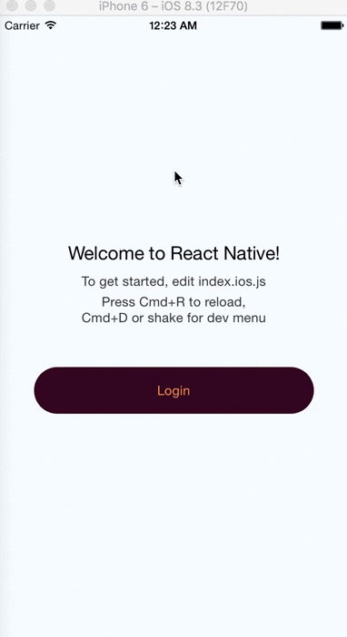

# react-native-md-motion-buttons (iOS / Android)

[](https://badge.fury.io/js/react-native-md-motion-buttons)

I wanted to re-create this animation with react-native (https://dribbble.com/shots/1945593-Login-Home-Screen)




# Installation

`npm install react-native-md-motion-buttons --save`

# Usage

```jsx
import React, { Component } from 'react';
import {
  AppRegistry,
  StyleSheet,
  Text,
  View,
  Button
} from 'react-native';
import { Login } from 'react-native-md-motion-buttons';

class Home extends Component {
  render() {
    return (<View style={[StyleSheet.absoluteFill, styles.container]}>
      <Text style={styles.welcome}>
        New screen
      </Text>
      <Button title="Reset" onPress={this.props.logout} />

    </View>)
  }
}

export default class examples extends Component {
  render() {
    const promise = () => new Promise((resolve, reject) => setTimeout(() => resolve(), 2000) );

    return (
        <Login.View style={styles.container} homeScreen={<Home />}>

          <Text style={styles.welcome}>
            Welcome to React Native!
          </Text>
          <Text style={styles.instructions}>
            To get started, edit index.ios.js
          </Text>
          <Text style={styles.instructions}>
            Press Cmd+R to reload,{'\n'}
            Cmd+D or shake for dev menu
          </Text>

          <Login.Button
              onPress={promise}
              style={styles.button}
              color="rgb(255,155,57)" />

        </Login.View>
    )
  }
}
```

#### View Props

| Prop | Type | Description |
|---|---|---|
|**`children`**|`ReactElement<any>`|React Element(s) to render. **Button must be a direct child.**|
|**`homeScreen`**|`ReactElement<any>`|New screen to render after the animation. `<View>` expose a `logout` function as a prop to this Component |
|**`style`**|`StyleSheet<any>`|Apply style to the View|

#### Button Props

| Prop | Type | Description |
|---|---|---|
|**`title`**|`?String`|Button title.  _Default : 'Login'_|
|**`color`**|`?String`|Text color.  _Default: 'white'_|
|**`style`**|`StyleSheet<any>`|Apply style to the Button.  _**backgroundColor** is required_|
|**`onPress`**|`() => Promise>`|Handle button click. **Must returned a promise**|

# Roadmap

## Next release

- [x] Add ripple effect for button
- [ ] Add a Floating Action Button (FAB) which will move to the center (like inVision dribble)
